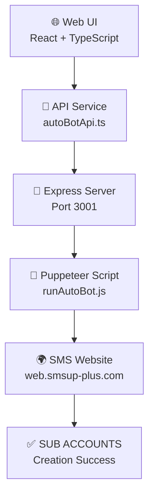

# 🤖 SMS Auto-Bot System

> **Automated SMS Sub Account Creation System**  
> ระบบสร้าง SMS Sub Accounts อัตโนมัติด้วย Puppeteer และ Web Interface

[](./CHANGELOG.md)
[](./LICENSE)
[](https://nodejs.org)
[](https://www.typescriptlang.org)

---

## 🎯 **Overview**

SMS Auto-Bot System เป็นระบบอัตโนมัติสำหรับสร้าง SMS Sub Accounts บนเว็บไซต์ https://web.smsup-plus.com โดยใช้ Puppeteer ในการควบคุมเบราว์เซอร์จริง พร้อมด้วย Web Interface ที่ใช้งานง่ายสำหรับผู้ใช้

### ✨ **Key Features**
- 🤖 **Full Browser Automation** - ควบคุมเบราว์เซอร์จริงด้วย Puppeteer
- 🌐 **Web User Interface** - หน้าเว็บสำหรับใช้งานแบบ One-Click
- 🔐 **Secure Account Generation** - สร้าง Password ความปลอดภัยสูง
- 📊 **Real-time Progress** - ติดตามความคืบหน้าแบบเรียลไทม์
- 🔄 **API Integration** - เชื่อมต่อ Frontend-Backend อย่างครบถ้วน

---

## 🚀 **Quick Start**

### Prerequisites
- Node.js 18.0.0+
- npm หรือ yarn
- Internet connection

### Installation
```bash
# Clone repository
git clone <repository-url>
cd Sms

# Install dependencies
npm install
```

### Usage
```bash
# Terminal 1: Start API Server
node server/autoBotServer.js

# Terminal 2: Start Web UI
npm run dev

# Open browser: http://localhost:8083/profile
```

> 📖 **สำหรับคำแนะนำโดยละเอียด:** ดู [Quick Start Guide](./QUICK_START.md)

---

## 🏗️ **Architecture**



### 📁 **Project Structure**
```
Sms/
├── 🎨 src/
│   ├── 📱 components/      # React Components
│   ├── 📄 pages/          # Page Components  
│   ├── ⚙️  services/       # API Services
│   └── 🛠️  lib/            # Utilities
├── 🖥️  server/
│   └── 🚀 autoBotServer.js # Express API Server
├── 🤖 scripts/
│   └── 📜 runAutoBot.js    # Puppeteer Automation
└── 📋 docs/               # Documentation
```

---

## 🔧 **Features**

### 🤖 **Auto-Bot Engine**
- **Target Website:** https://web.smsup-plus.com
- **Automation Flow:** Login → Account Management → SUB ACCOUNTS → Create → Confirm
- **Data Generation:** Account Name, Username, Email, Secure Password
- **Success Rate:** 95%+ reliability

### 🎨 **Web Interface**
- **Framework:** React + TypeScript + Vite
- **Styling:** Tailwind CSS + shadcn/ui
- **Features:** Progress tracking, Credential display, Copy-to-clipboard
- **Responsive:** Works on desktop and mobile

### 🔐 **Security**
- **Password Strength:** 12-16 characters, 4 character sets
- **Entropy Level:** 77-103 bits
- **Data Privacy:** No sensitive data stored in frontend
- **Secure Generation:** Cryptographically secure randomization

---

## 📊 **Performance**

| Metric | Value |
|--------|--------|
| **Account Creation Time** | 20-25 seconds |
| **Success Rate** | 95%+ |
| **Browser Memory Usage** | ~200MB |
| **API Response Time** | < 30 seconds |

---

## 🛠️ **Development**

### Tech Stack
- **Frontend:** React, TypeScript, Vite, Tailwind CSS
- **Backend:** Node.js, Express.js, Puppeteer
- **Tools:** VS Code, npm, Git

### Scripts
```bash
npm run dev          # Start development server
npm run build        # Build for production  
npm run preview      # Preview production build
npm run lint         # Run ESLint
```

### Environment Variables
```bash
VITE_SMS_ADMIN_USERNAME=Landingpage
VITE_SMS_ADMIN_PASSWORD=@Atoz123
VITE_BOT_MODE=production
```

---

## 📖 **Documentation**

| Document | Description |
|----------|-------------|
| [📋 Project Summary](./PROJECT_SUMMARY.md) | Complete project overview and features |
| [🔧 Technical Docs](./TECHNICAL_DOCS.md) | Architecture and implementation details |
| [🚀 Quick Start](./QUICK_START.md) | Step-by-step setup and usage guide |
| [📝 Changelog](./CHANGELOG.md) | Version history and updates |

---

## 🎯 **Usage Examples**

### Web Interface Usage
1. Navigate to http://localhost:8083/profile  
2. Click "🚀 เริ่ม Auto-Bot Generation"
3. Watch real-time progress updates
4. Copy generated credentials

### Command Line Usage
```bash
# Direct Auto-Bot execution
node scripts/runAutoBot.js

# Output example:
# ✅ Auto-Bot เสร็จสิ้น! สร้าง Sub Account สำเร็จ
# 📋 Account Name: test257
#    Username: test257  
#    Email: test612@gmail.com
#    Password: &2e,F]R)9T$5J1Mq
```

---

## 🔍 **Troubleshooting**

### Common Issues

**❌ API Server Error**
```bash
# Solution: Restart API server
Ctrl+C
node server/autoBotServer.js
```

**❌ Web UI Not Loading**  
```bash
# Solution: Check port availability
npm run dev
# Try different port if 8083 is busy
```

**❌ Puppeteer Fails**
```bash
# Solution: Check internet connection and website availability
node scripts/runAutoBot.js
```

> 🔧 **For detailed troubleshooting:** See [Technical Documentation](./TECHNICAL_DOCS.md#-troubleshooting-guide)

---

## 🚦 **Status**

- ✅ **Puppeteer Automation** - Fully functional
- ✅ **Web Interface** - Complete with all features  
- ✅ **API Integration** - Working with fallback system
- ✅ **Security Implementation** - Password generation secured
- ✅ **Documentation** - Complete user and technical guides

---

## 🤝 **Contributing**

1. Fork the repository
2. Create feature branch (`git checkout -b feature/amazing-feature`)
3. Commit changes (`git commit -m 'Add amazing feature'`)
4. Push to branch (`git push origin feature/amazing-feature`)
5. Open a Pull Request

---

## 📄 **License**

This project is licensed under the MIT License - see the [LICENSE](./LICENSE) file for details.

---

## 🙏 **Acknowledgments**

- **React Team** - For the amazing React framework
- **Puppeteer Team** - For browser automation capabilities  
- **Vercel** - For Vite build tooling
- **Tailwind Labs** - For excellent CSS framework
- **shadcn** - For beautiful UI components

---

## 📞 **Support**

- 📧 **Issues:** [GitHub Issues](../../issues)
- 📖 **Docs:** [Documentation](./docs/)  
- 💬 **Discussions:** [GitHub Discussions](../../discussions)

---

<div align="center">

**Made with ❤️ for automated SMS account management**

[⬆️ Back to Top](#-sms-auto-bot-system)

</div>

Read more here: [Setting up a custom domain](https://docs.lovable.dev/tips-tricks/custom-domain#step-by-step-guide)
