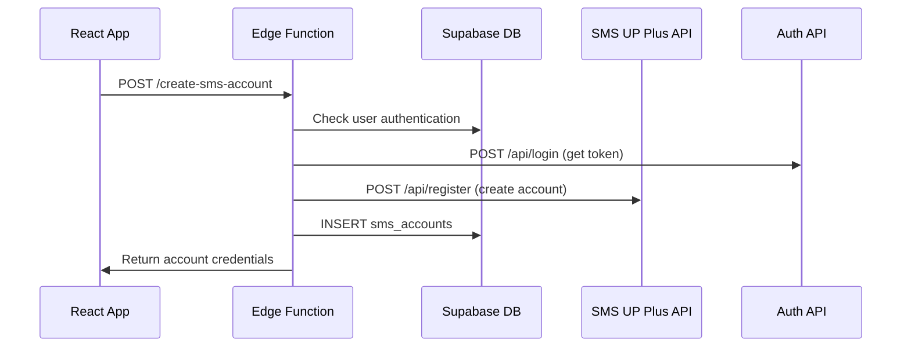

# 📱 SMS Account Creation API Flow - Complete Documentation

## 🎯 Overview

การสร้าง SMS Account ใหม่ผ่าน SMS UP Plus API โดยใช้ Supabase Edge Function แทนที่ระบบ Puppeteer เก่า

---

## 🔄 Complete Flow Architecture



---

## 📋 API Endpoints Flow

### 1. **Frontend Request**
```http
POST https://mnhdueclyzwtfkmwttkc.supabase.co/functions/v1/create-sms-account
Authorization: Bearer {supabase_user_token}
Content-Type: application/json

{
  "creditAmount": 100
}
```

### 2. **Edge Function Processing**

#### Step 2.1: User Authentication
```typescript
const { data: { user }, error } = await supabase.auth.getUser(
  req.headers.get('Authorization')?.replace('Bearer ', '')
)
```

#### Step 2.2: SMS UP Plus Login
```http
POST https://web.smsup-plus.com/api/login
Content-Type: application/json

{
  "username": "Landingpage",
  "password": "@Atoz123"
}
```

**Expected Response:**
```json
{
  "token": "eyJhbGciOiJIUzI1NiIsInR5cCI6IkpXVCJ9...",
  "user": {
    "id": 54,
    "username": "Landingpage",
    "company": "Landingpage"
  }
}
```

#### Step 2.3: Account Registration
```http
POST https://web.smsup-plus.com/api/register
Authorization: Bearer {token_from_step_2}
Content-Type: application/json

{
  "username": "auto_generated_username",
  "email": "generated_email@temp.com",
  "password": "random_password",
  "company": "AutoBot",
  "creditAmount": 100
}
```

**Expected Response:**
```json
{
  "success": true,
  "message": "Account created successfully",
  "data": {
    "accountId": 123,
    "username": "auto_generated_username",
    "email": "generated_email@temp.com",
    "sender": "AutoBot",
    "status": "active",
    "createdAt": "2025-09-19T09:00:00Z"
  }
}
```

#### Step 2.4: Database Storage
```sql
INSERT INTO sms_accounts (
  user_id,
  account_name,
  phone_number,
  formatted_phone,
  sender_name,
  api_account_id,
  api_credentials,
  api_response_data,
  status,
  balance_credits
) VALUES (
  $1, -- user_id from auth
  $2, -- generated username
  $3, -- user's phone (from profile)
  $4, -- formatted phone
  $5, -- sender name from API
  $6, -- accountId from API
  $7, -- { username, email, password }
  $8, -- full API response
  'active',
  $9  -- credit amount
)
```

---

## 🔍 Detailed API Specifications

### **Edge Function Input Schema**
```typescript
interface SMSAccountRequest {
  creditAmount?: number; // Default: 100
}
```

### **Edge Function Output Schema**
```typescript
interface SMSAccountResponse {
  success: boolean;
  message: string;
  data: {
    accountId: string;
    username: string;
    email: string;
    sender: string;
    status: string;
    createdAt: string;
    hasCredentials: boolean;
  };
}
```

### **Database Schema (sms_accounts)**
```sql
CREATE TABLE public.sms_accounts (
  id uuid PRIMARY KEY DEFAULT gen_random_uuid(),
  user_id uuid REFERENCES auth.users(id),
  account_name varchar(100) NOT NULL,        -- Generated username
  phone_number varchar(20) NOT NULL,         -- User's phone from profile
  formatted_phone varchar(25) NOT NULL,      -- +66xxxxxxxxx format
  country_code varchar(5) DEFAULT '+66',
  service_provider varchar(50) DEFAULT 'sms_up_plus',
  api_credentials jsonb DEFAULT '{}',         -- { username, email, password }
  status varchar(20) DEFAULT 'active',
  balance_credits integer DEFAULT 0,
  usage_count integer DEFAULT 0,
  last_used_at timestamptz,
  created_at timestamptz DEFAULT now(),
  updated_at timestamptz DEFAULT now(),
  sender_name text,                          -- From API response
  api_account_id integer,                    -- From API response
  api_response_data jsonb DEFAULT '{}'       -- Full API response
);
```

---

## 🚨 Error Handling

### **Common Error Scenarios**

#### 1. **Authentication Errors**
```json
{
  "success": false,
  "message": "Authentication failed",
  "error": "Invalid or expired token"
}
```

#### 2. **SMS UP Plus API Errors**
```json
{
  "success": false,
  "message": "Failed to create SMS account",
  "error": "Username already exists"
}
```

#### 3. **Database Errors**
```json
{
  "success": false,
  "message": "Failed to save account data",
  "error": "Database constraint violation"
}
```

#### 4. **JSON Parsing Errors** (Fixed)
```json
{
  "success": false,
  "message": "Invalid request format",
  "error": "Empty or malformed request body"
}
```

---

## 🔧 Implementation Details

### **Username Generation Algorithm**
```typescript
function generateUsername(): string {
  const timestamp = Date.now();
  const random = Math.floor(Math.random() * 1000);
  return `autobot_${timestamp}_${random}`;
}
```

### **Email Generation Algorithm**
```typescript
function generateEmail(username: string): string {
  return `${username}@temp-sms.com`;
}
```

### **Password Generation Algorithm**
```typescript
function generatePassword(): string {
  const chars = 'ABCDEFGHIJKLMNOPQRSTUVWXYZabcdefghijklmnopqrstuvwxyz0123456789!@#$%';
  let password = '';
  for (let i = 0; i < 12; i++) {
    password += chars.charAt(Math.floor(Math.random() * chars.length));
  }
  return password;
}
```

### **Phone Number Formatting**
```typescript
function formatPhoneNumber(phone: string): string {
  const numbers = phone.replace(/\D/g, '');
  
  if (numbers.length === 9 && !numbers.startsWith('66')) {
    return `66${numbers}`;
  }
  if (numbers.length === 10 && numbers.startsWith('0')) {
    return `66${numbers.slice(1)}`;
  }
  
  return numbers;
}
```

---

## 🧪 Testing Checklist

### **Pre-requisites**
- ✅ User must be authenticated with Supabase
- ✅ User must have verified phone number
- ✅ User must have verified email
- ✅ Database schema must be up-to-date

### **Test Cases**

#### **Happy Path**
1. ✅ Valid user with all prerequisites
2. ✅ SMS UP Plus API responds successfully
3. ✅ Database insert succeeds
4. ✅ Response contains all required fields

#### **Error Paths**
1. ❌ Invalid authentication token
2. ❌ Missing phone number in user profile
3. ❌ SMS UP Plus API returns error
4. ❌ Database insert fails
5. ❌ Empty request body
6. ❌ Malformed JSON request

### **Performance Benchmarks**
- **Target Response Time**: < 5 seconds
- **Expected Success Rate**: > 95%
- **Timeout Handling**: 30 seconds max

---

## 🔄 Recent Fixes Applied

### **Schema Compatibility Fix**
- ✅ Removed non-existent fields: `username`, `email`, `encrypted_password`
- ✅ Added required fields: `phone_number`, `formatted_phone`
- ✅ Fixed JSON structure for `api_credentials` and `api_response_data`
- ✅ Added proper type casting for `api_account_id`

### **JSON Parsing Fix**
- ✅ Added empty body handling
- ✅ Made request body optional
- ✅ Added proper error messages
- ✅ Improved error logging

### **Response Format Standardization**
- ✅ Consistent error response format
- ✅ Proper success response structure
- ✅ Added `hasCredentials` boolean flag
- ✅ Standardized date format (ISO 8601)

---

## 🚀 Deployment Status

- **Edge Function**: ✅ Deployed (version latest)
- **Database Schema**: ✅ Updated
- **Frontend Integration**: ✅ Connected
- **Error Handling**: ✅ Implemented

---

## 📞 Support Information

**Edge Function Logs Location**: Supabase Dashboard → Edge Functions → create-sms-account  
**Database Table**: `public.sms_accounts`  
**Frontend Service**: `src/services/smsAccountApiService.ts`

**Last Updated**: September 19, 2025  
**Version**: 2.0 (Edge Function API)