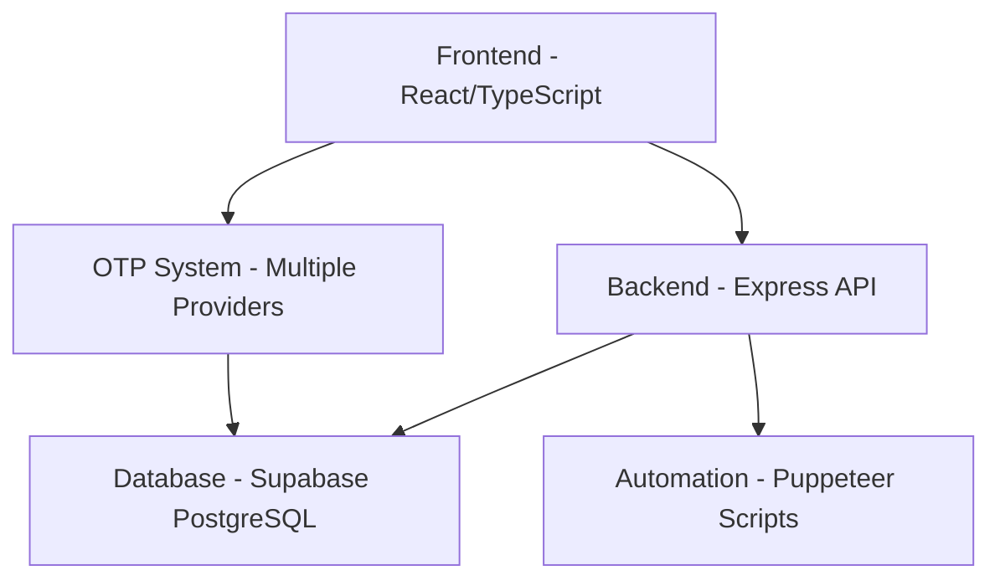
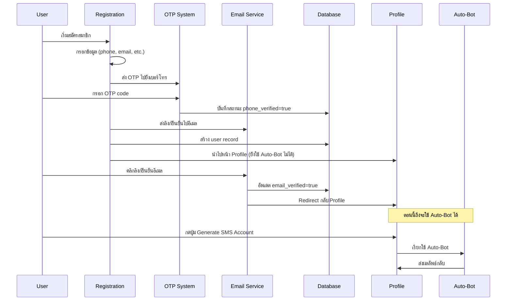

# 📊 การวิเคราะห์โครงสร้างระบบสมาชิก SMS OTP และ Auto-Bot

## 🎯 **ภาพรวมระบบปัจจุบัน**

จากการวิเคราะห์โค้ดและเอกสารประกอบทั้งหมด สามารถสรุปโครงสร้างระบบปัจจุบันได้ดังนี้:

### 🏗️ **สถาปัตยกรรมปัจจุบัน**



### 📋 **ระบบที่มีอยู่แล้ว**

#### ✅ **ระบบที่ครบถ้วนแล้ว:**
1. **SMS Auto-Bot System** - `scripts/runAutoBot.js` (651 lines)
2. **OTP Verification System** - 8 services implementations
3. **Database Schema** - Supabase + PostgreSQL พร้อม migrations
4. **Frontend Components** - React components พร้อม UI
5. **Registration Form** - `Register.tsx` (715 lines) with validation

#### 🔄 **ระบบที่ต้องปรับปรุง:**
1. **Authentication Flow** - ยังไม่มีการเชื่อมต่อ OTP กับ Registration
2. **Email Verification** - ยังไม่มี callback page และ verification flow
3. **Authorization Guards** - ต้องเพิ่มเงื่อนไขการตรวจสอบก่อนใช้ Auto-Bot

---

## 🔍 **ข้อมูลโดยละเอียดของระบบปัจจุบัน**

### 1. **🤖 SMS Auto-Bot System**

**ไฟล์หลัก:** `scripts/runAutoBot.js`
**สถานะ:** ✅ พร้อมใช้งาน (95%+ success rate)

**ฟีเจอร์:**
- Browser automation ด้วย Puppeteer
- Target: https://web.smsup-plus.com
- Secure password generation (77-103 bits entropy)
- Account creation workflow สมบูรณ์
- Integration ผ่าน Express API (`server/autoBotServer.js`)

**Performance:**
- Execution time: 20-25 วินาที
- Success rate: 95%+
- Memory usage: ~200MB

### 2. **🔐 OTP Verification System**

**สถานะ:** ✅ ระบบสมบูรณ์ - มี 8 implementations

**Services ที่มี:**
```
src/services/
├── antsOTPService.ts          # ANTS API integration
├── enhancedOTPService.ts      # Enhanced with database
├── supabaseOTPService.ts      # Supabase direct integration
├── simpleOTPService.ts        # Simplified wrapper
├── edgeFunctionOTPService.ts  # Edge functions
├── mockOTPService.ts          # Testing/development
├── otpService.ts              # Main service
└── otpServiceSwitcher.ts      # Dynamic switching
```

**ฟีเจอร์:**
- Phone number validation และ formatting
- Rate limiting protection
- Session management
- Database integration
- Audit logging
- Multiple fallback providers

**Database Tables:**
- `otp_verifications` - OTP session tracking
- `verified_phone_numbers` - Verified phone registry
- RLS policies for security

### 3. **📝 Registration System**

**ไฟล์หลัก:** `src/pages/Register.tsx` (715 lines)
**สถานะ:** ✅ Form complete แต่ต้อง integrate OTP + Email

**ฟีเจอร์:**
- Multi-step registration form
- Personal/Corporate account types
- Password strength validation
- Form validation และ error handling
- Supabase integration

**ข้อมูลที่เก็บ:**
- Personal: firstName, lastName, username, email, phone, password
- Corporate: company details, tax ID, authorized person
- Address information
- Terms acceptance

### 4. **👤 Profile System**

**ไฟล์หลัก:** `src/pages/Profile.tsx` (442 lines)
**สถานะ:** ✅ Auto-Bot integration complete

**ฟีเจอร์:**
- User profile display
- SMS account generation interface
- Real-time progress tracking
- Credential display with copy functionality
- Integration กับ `generateSMSAccount` service

**Current Access:** ไม่มี authentication guards

### 5. **🗄️ Database Structure**

**Supabase Tables ที่มี:**
```sql
-- OTP System
otp_verifications
verified_phone_numbers
otp_service_tokens

-- User System (ต้องเพิ่ม)
users (ยังไม่มี comprehensive schema)
```

**Missing Fields สำหรับ new flow:**
- `phone_verified` boolean
- `email_verified` boolean  
- `verified_at` timestamp
- `can_use_autobot` computed field

---

## 🎯 **Authentication Flow ที่ต้องการ**

### 📋 **Flow Diagram ใหม่**



### 🔒 **Authorization Rules**

1. **Registration Access:** Anyone
2. **Profile Access:** Registered users only
3. **Auto-Bot Access:** Registered + Phone verified + Email verified

---

## 🛠️ **งานที่ต้องทำเพื่อปรับปรุงระบบ**

### ✨ **ลำดับงานตาม Priority**

#### **Priority 1: Authentication Flow Integration**
1. **ปรับปรุง Registration.tsx**
   - เพิ่ม OTP verification step
   - เพิ่มการส่ง email verification
   - Update database schema

2. **สร้าง Email Verification System**
   - Email verification callback page
   - Email sending service
   - Verification status tracking

#### **Priority 2: Authorization Guards**
3. **ปรับปรุง AuthGuard.tsx**
   - เพิ่มเงื่อนไข phone_verified
   - เพิ่มเงื่อนไข email_verified

4. **ปรับปรุง Profile.tsx**
   - เพิ่ม verification status display
   - Disable Auto-Bot ถ้าไม่ verified

#### **Priority 3: Database Schema**
5. **อัพเดต User Table**
   - เพิ่ม verification fields
   - Migration scripts

6. **Integration Testing**
   - ทดสอบ flow ทั้งหมด
   - Error handling

---

## 📊 **Current vs Target Architecture**

### **Current State:**
```
Registration → Profile → Auto-Bot
     ↓
  Database
```

### **Target State:**
```
Registration → OTP Verify → Email Verify → Profile → Auto-Bot
     ↓             ↓            ↓           ↓
  Database ← Phone Check ← Email Check ← AuthGuard
```

---

## 🔧 **Technical Implementation Details**

### **ไฟล์ที่ต้องแก้ไข:**

1. **Frontend Components:**
   ```
   src/pages/Register.tsx       # เพิ่ม OTP + email steps
   src/pages/Profile.tsx        # เพิ่ม verification guards
   src/components/AuthGuard.tsx # เพิ่ม verification checks
   ```

2. **New Components ที่ต้องสร้าง:**
   ```
   src/pages/VerifyEmail.tsx    # Email verification callback
   src/components/VerificationBanner.tsx # Status display
   ```

3. **Services:**
   ```
   src/services/authService.ts     # User authentication
   src/services/emailService.ts    # Email verification
   ```

4. **Database:**
   ```
   database/04_add_verification_fields.sql # User table updates
   supabase/migrations/            # New migration
   ```

### **Integration Points:**

1. **Registration → OTP:**
   ```typescript
   // ใน Register.tsx
   const handlePhoneVerification = async () => {
     const result = await simpleOTPService.sendOTP({
       phoneNumber: formData.phone,
       userId: newUser.id
     });
   };
   ```

2. **Profile → Auto-Bot Guard:**
   ```typescript
   // ใน Profile.tsx
   const canUseAutoBot = user?.phone_verified && user?.email_verified;
   
   <Button 
     disabled={!canUseAutoBot}
     onClick={generateSMSAccountReal}
   >
     {canUseAutoBot ? 'เริ่ม Auto-Bot' : 'ต้องยืนยันข้อมูลก่อน'}
   </Button>
   ```

---

## 🎯 **สรุปและข้อเสนอแนะ**

### ✅ **จุดแข็งของระบบปัจจุบัน:**
1. **OTP System สมบูรณ์** - มี 8 implementations พร้อม fallback
2. **Auto-Bot System เสถียร** - Success rate 95%+
3. **Database Schema ดี** - มี RLS policies และ audit logging
4. **UI Components ครบถ้วน** - shadcn/ui + React
5. **Documentation ดีเยี่ยม** - 20+ markdown files

### ⚠️ **จุดที่ต้องปรับปรุง:**
1. **Authentication Flow ไม่ต่อเนื่อง** - Registration → Profile ไม่มี verification
2. **Email Verification ไม่มี** - ต้องสร้างใหม่ทั้งหมด
3. **Authorization Guards ไม่เพียงพอ** - Profile accessible โดยไม่ต้อง verify
4. **User Experience ไม่ชัดเจน** - User ไม่รู้ว่าต้อง verify อะไรก่อน

### 🚀 **แผนการดำเนินงาน:**

**Phase 1 (วันที่ 1-2):** Integration OTP + Registration
**Phase 2 (วันที่ 3-4):** Email Verification System  
**Phase 3 (วันที่ 5-6):** Authorization Guards + Testing
**Phase 4 (วันที่ 7):** Final Testing + Documentation

### 💡 **ข้อเสนอแนะเพิ่มเติม:**

1. **UX Enhancement:** เพิ่ม progress indicators ใน registration flow
2. **Error Handling:** ปรับปรุง error messages ให้ชัดเจนขึ้น
3. **Security:** เพิ่ม rate limiting ใน email verification
4. **Monitoring:** เพิ่ม analytics tracking สำหรับ conversion rate

---

**สรุป:** ระบบมีพื้นฐานที่แข็งแกร่งมาก แต่ต้องเชื่อมต่อ components ที่มีอยู่ให้ทำงานร่วมกันเป็น flow เดียว การปรับปรุงจะเน้นไปที่ integration มากกว่าการสร้างใหม่

<div align="center">

**📊 System Architecture Analysis Report**
*Generated: September 15, 2025*

</div>